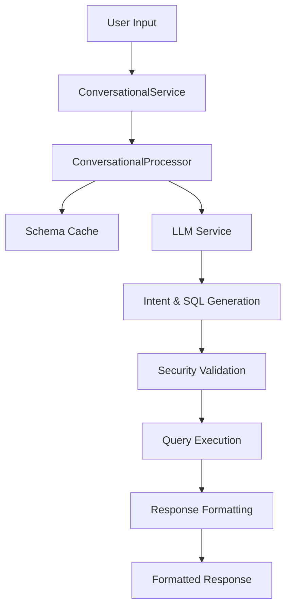

# 🤖 Conversational AI Database Library


Transform natural language into database operations with AI-powered conversational interfaces. This Spring Boot library enables developers to build intelligent database query systems that understand human language and execute secure SQL operations.

## ✨ Features

- 🗣️ **Natural Language Processing**: Convert human queries into structured database operations
- 🔒 **Security First**: Built-in security validation and SQL injection prevention
- 🚀 **Spring Boot Integration**: Seamless integration with existing Spring applications
- 📊 **Multi-Operation Support**: Handle CREATE, READ, UPDATE, DELETE, and COUNT operations
- 🧠 **LLM Integration**: Pluggable LLM service for processing conversational requests
- 📋 **Smart Schema Handling**: Automatic database schema analysis and caching
- 🎯 **Intent Recognition**: Intelligent understanding of user intentions
- 📝 **Formatted Responses**: Human-friendly response formatting with rich text support
- ⚡ **Performance Monitoring**: Built-in processing time tracking
- 🔄 **Session Management**: Support for user sessions and context

## 🚀 Quick Start

### Installation

Clone the library and do mvn clean install

not yet on mvn central repository(I should publish it there soon), after you can now add the dependency to your project

Add the dependency to your `pom.xml`:

```xml
<dependency>
       <groupId>com.conversationalai</groupId>
    <artifactId>conversationalai</artifactId>
    <version>0.0.1-SNAPSHOT</version>
</dependency>
```

### Basic Usage

```java
@RestController
public class ConversationalController {
    
    @Autowired
    private ConversationalService conversationalService;
    
    @PostMapping("/chat")
    public ConversationalResponse chat(@RequestBody ChatRequest request) {
        return conversationalService.processRequest(
            request.getUserInput(),
            request.getSessionId(),
            request.getUserId()
        );
    }
}
```

### Example Queries

The library understands natural language queries like:

```
"Show me all users who registered last month"
"Create a new product with name 'iPhone 15' and price 999"
"How many orders were placed today?"
"Update the customer email for John Doe"
"Delete all expired sessions"
```

## 🏗️ Architecture

### Core Components

- **ConversationalProcessor**: Main processing engine that orchestrates the entire flow
- **ConversationalService**: Spring service layer providing clean API access
- **LLMService**: Interface for integrating with language models (OpenAI, Claude, etc.)
- **SecurityValidator**: Ensures all operations are secure and authorized
- **QueryExecutor**: Handles safe SQL execution with parameter binding
- **SchemaCache**: Intelligent caching of database schema information
- **ResponseFormatter**: Creates human-friendly responses with rich formatting

### Request Flow



## 🔧 Configuration

### Application Properties

```yaml
conversational-ai:
  llm:
    provider: openai  # or claude, huggingface, etc.
    api-key: ${LLM_API_KEY}
    model: gpt-4
  security:
    allowed-operations: [READ, CREATE, UPDATE, DELETE, COUNT]
    max-query-complexity: 10
  cache:
    schema-ttl: 3600  # seconds
```

### Bean Configuration

```java
@Configuration
public class ConversationalAIConfig {
    
    @Bean
    public LLMService llmService() {
        return new OpenAILLMService(apiKey, model);
    }
    
    @Bean
    public SecurityValidator securityValidator() {
        return new DefaultSecurityValidator(allowedOperations);
    }
}
```

## 📋 Supported Operations

| Operation | Description | Example Query |
|-----------|-------------|---------------|
| **READ** | Retrieve records | "Show me all active users" |
| **CREATE** | Insert new records | "Add a new customer named John" |
| **UPDATE** | Modify existing records | "Update Sarah's email address" |
| **DELETE** | Remove records | "Delete cancelled orders" |
| **COUNT** | Count records | "How many products do we have?" |
| **LIST** | List with pagination | "Show the first 10 orders" |

## 🔒 Security Features

- **Intent Validation**: Only allowed operations are executed
- **SQL Injection Prevention**: Parameterized queries and input sanitization
- **Access Control**: Role-based operation restrictions
- **Query Complexity Limits**: Prevent resource-intensive operations
- **Audit Logging**: Track all database operations

## 🎨 Response Formatting

The library provides rich, formatted responses:

```
✅ **Record Created Successfully**

Great! I've successfully added the new record to the database.

📊 **Query Results** (showing 5 of 127 records)

| Name | Email | Status |
|------|-------|--------|
| John Doe | john@example.com | Active |
| Jane Smith | jane@example.com | Pending |
```

## 🧪 Testing

Run the test suite:

```bash
mvn test
```

The library includes comprehensive tests for:
- Natural language processing
- Security validation
- Query execution
- Response formatting
- Error handling

## 📚 Sample Application

Check out the `/sample` directory for a complete working example that demonstrates:

- REST API endpoints
- Web interface for testing
- Integration with popular databases
- Custom LLM implementations
- Advanced configuration options

## 🤝 Contributing

We welcome contributions! Here's how you can help:

### 🐛 Found a Bug?
- Open an issue with a clear description
- Include steps to reproduce
- Provide sample code if possible

### 💡 Have an Enhancement Idea?
- Check existing issues first
- Open a new issue to discuss your idea
- Submit a pull request with your implementation

### 🔧 Want to Contribute Code?
1. Fork the repository
2. Create a feature branch (`git checkout -b feature/amazing-feature`)
3. Make your changes
4. Add tests for new functionality
5. Ensure all tests pass (`mvn test`)
6. Commit your changes (`git commit -m 'Add amazing feature'`)
7. Push to the branch (`git push origin feature/amazing-feature`)
8. Open a Pull Request

### 📖 Documentation Improvements
- Fix typos or unclear explanations
- Add examples and use cases
- Improve code comments
- Translate documentation

## 🛣️ Roadmap

- [ ] Support for complex joins and subqueries
- [ ] Multi-database support (PostgreSQL, MySQL, MongoDB)
- [ ] GraphQL integration
- [ ] Real-time query streaming
- [ ] Advanced analytics and reporting
- [ ] Plugin system for custom operations
- [ ] Multi-language support


## 🙏 Acknowledgments

- Spring Boot team for the excellent framework (I have been studing thei code base for some time now)

- All contributors who help improve this library

## 📞 Support

- 📧 Email: adetoyesamuel63@gmail.com
- 🐛 Issues: [GitHub Issues](https://github.com/yourusername/conversational-ai/issues)

---

⭐ **Star this repository if you find it useful!** ⭐

